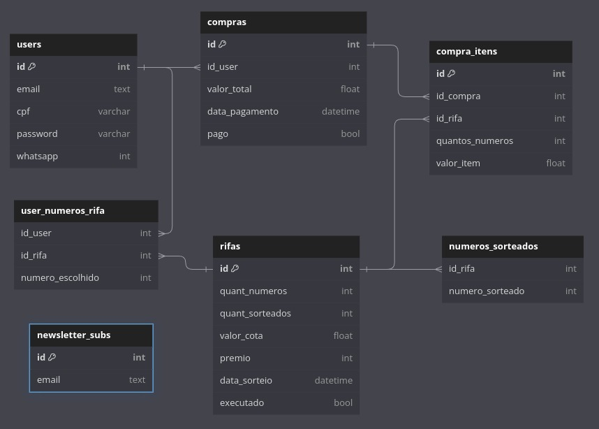

  
# Rifa
## Tecnologias:

### Backend:
- NodeJS
- Framework Express
- Pacote Sequelize para migrations

### Frontend:
Só será criado depois de completar o backend  
- NodeJS
- React

### Banco de Dados
- PostgreSQL
- Container Docker com Docker-compose  
OBS: Os dados das pastas "database_data" e "postgres_transferencias" precisam de permissão para serem alteradas.  
  

Página de sorteio, com banco de dados em Docker, Node com Express, React, Autenticação e outros.


1. Iniciar o servidor Postgres
```
docker-compose up -d
```

2. No servidor api instale as dependências
```
npm install
```

3. Rode as migrations
```
npx sequelize-cli db:migrate
```

4. Inicie o servidor API

```
npm start
```

5. No servidor UI React instale as dependências
```
npm install
```

4. Inicie o servidor UI

```
npm start
```
  
  



# Documentação da API

## Índice
1. [Autenticação](#autenticação)
2. [Usuários](#usuários)
3. [Rifa](#rifa)

## Autenticação

### Login
- **Método:** POST
- **Endpoint:** `/login`
- **Descrição:** Autentica um usuário e gera um token JWT.
- **Requisitos:** 
  - `username` (string, obrigatório)
  - `password` (string, obrigatório)
- **Resposta de Sucesso:**
  - **Código:** 200 OK
  - **Corpo:** 
    ```json
    {
      "token": "jwt_token"
    }
    ```
- **Resposta de Erro:**
  - **Código:** 401 Unauthorized
  - **Corpo:** 
    ```json
    {
      "message": "Credenciais inválidas"
    }
    ```

## Usuários

### Obter Informações do Usuário
- **Método:** GET
- **Endpoint:** `/user`
- **Descrição:** Obtém informações do usuário logado.
- **Requisitos:** 
  - Cabeçalho: `Authorization: Bearer <token>`
- **Resposta de Sucesso:**
  - **Código:** 200 OK
  - **Corpo:** 
    ```json
    {
      "username": "example_user",
      "email": "user@example.com"
    }
    ```
- **Resposta de Erro:**
  - **Código:** 401 Unauthorized
  - **Corpo:** 
    ```json
    {
      "message": "Token inválido"
    }
    ```

## Rifa

### Comprar Número de Rifa
- **Método:** POST
- **Endpoint:** `/comprarnumerorifa`
- **Descrição:** Permite a compra de um número de rifa.
- **Requisitos:** 
  - Cabeçalho: `Authorization: Bearer <token>`
  - Corpo:
    ```json
    {
      "numero": "12345"
    }
    ```
- **Resposta de Sucesso:**
  - **Código:** 200 OK
  - **Corpo:** 
    ```json
    {
      "message": "Número comprado com sucesso"
    }
    ```
- **Resposta de Erro:**
  - **Código:** 400 Bad Request
  - **Corpo:** 
    ```json
    {
      "message": "Número inválido"
    }
    ```


## Newsletter

### Assinar a Newsletter
- **Método:** POST
- **Endpoint:** `/newsletter-subs`
- **Descrição:** Registra um Email na lista de newsletter.
- **Requisitos:**
  - Corpo:
    ```json
    {
      "email": "abc@teste.com"
    }
    ```
- **Resposta de Sucesso:**
  - **Código:** 201 CREATED
  - **Corpo:** 
    ```json
    {
        "id": 3,
        "email": "abc@teste.com",
        "updatedAt": "2024-08-11T23:12:49.458Z",
        "createdAt": "2024-08-11T23:12:49.458Z"
    }
    ```
- **Resposta de Erro:**
  - **Código:** 400 Bad Request
  - **Corpo:** 
    ```json
    {
        "errors": [
            {
                "type": "field",
                "value": "teste",
                "msg": "Invalid email",
                "path": "email",
                "location": "body"
            }
        ]
    }
    ```

---

**Notas:** 
- Certifique-se de que o token JWT seja enviado no cabeçalho `Authorization` como `Bearer <token>`.
- Todos os endpoints que exigem autenticação devem validar o token JWT fornecido.


